# SIH26143 Maritime Oil-Spill Attribution

```mermaid
flowchart LR
    %% User-facing system and external data sources
    USER["Investigator / Analyst"]
    FRONTEND["Frontend web application\nCase workspace + map + evidence review"]
    SAR["Sentinel-1 SAR image\nGeoTIFF"]
    MET["ERA5 wind data"]
    OCEAN["HYCOM ocean currents"]
    AIS["Historical AIS vessel\ntrack data"]

    subgraph JAVA["Java Spring Boot backend\nREST API + workflow orchestration"]
        CASE["Case management\nAuthentication + authorization"]
        ORCH["Pipeline orchestrator\nState machine + job queue"]
        CLIENTS["Typed FastAPI clients\nTimeouts + retries + correlation IDs"]
        RESULTS["Results + evidence API\nPostgreSQL + object storage"]
        CASE --> ORCH --> CLIENTS
        ORCH --> RESULTS
    end

    subgraph AIML["Python AI/ML microservices (separate FastAPI applications)"]
        direction LR

        subgraph S1["Stage 1 - Slick Detection\nPOST /detect-slick"]
            direction TB
            P1["Calibration\nLee filter + land mask"]
            U1["U-Net CNN segmentation\nPyTorch"]
            G1["Polygon conversion\nrasterio / GDAL / shapely"]
            O1["SlickDetectionResult\nGeoJSON + timestamp + stats"]
            P1 --> U1 --> G1 --> O1
        end

        subgraph S2["Stage 2 - Drift Hindcast\nPOST /hindcast"]
            direction TB
            P2["OpenDrift / OpenOil\nBackward particle simulation"]
            F2["ERA5 + HYCOM forcing\nLeeway + Coriolis"]
            O2["DriftHindcastResult\nOrigin field + spill window"]
            P2 --> F2 --> O2
        end

        subgraph S3["Stage 3 - AIS Correlation\nPOST /correlate"]
            direction TB
            P3["Spatial-temporal filtering\nCPA + timing score"]
            A3["Speed/course anomalies\nAIS gap detection"]
            O3["Weighted evidence scoring"]
            R3["VesselAttributionResult\nRanked candidates + evidence"]
            P3 --> A3 --> O3 --> R3
        end
    end

    USER --> FRONTEND -->|REST / HTTPS| CASE
    SAR -->|Stored input reference| CASE
    MET -->|Dataset reference| CASE
    OCEAN -->|Dataset reference| CASE
    AIS -->|Track reference| CASE
    CLIENTS -->|REST / JSON| S1
    CLIENTS -->|REST / JSON| S2
    CLIENTS -->|REST / JSON| S3
    O1 -->|Internal pipeline result| CLIENTS
    O2 -->|Internal pipeline result| CLIENTS
    R3 -->|Persisted result| RESULTS
    RESULTS -->|Ranked vessels + evidence| FRONTEND

    classDef external fill:#F4F1DE,stroke:#8A6D3B,color:#2B2417,stroke-width:1.5px
    classDef stage1 fill:#DCEEFF,stroke:#2E6FAD,color:#102A43,stroke-width:1.5px
    classDef stage2 fill:#DDF3E4,stroke:#2F855A,color:#173B2A,stroke-width:1.5px
    classDef stage3 fill:#FFE4D6,stroke:#C05621,color:#48200F,stroke-width:1.5px
    classDef boundary fill:#FFFFFF,stroke:#334E68,color:#102A43,stroke-width:2px

    class USER,FRONTEND,SAR,MET,OCEAN,AIS external
    class P1,U1,G1,O1 stage1
    class P2,F2,O2 stage2
    class P3,A3,O3,R3 stage3
    class AIML boundary

    style S1 fill:#F3F8FE,stroke:#2E6FAD,stroke-width:2px
    style S2 fill:#F3FBF5,stroke:#2F855A,stroke-width:2px
    style S3 fill:#FFF7F2,stroke:#C05621,stroke-width:2px
```

## Pipeline Contract

1. The frontend sends case commands to the Java Spring Boot backend over REST; the frontend never calls the Python services directly.
2. The backend stores source references and invokes `POST /detect-slick` through `SlickDetectionClient`. The FastAPI service accepts a Sentinel-1 SAR GeoTIFF reference and returns a GeoJSON slick polygon, acquisition timestamp, and geometry statistics.
3. The backend passes the detection result to `POST /hindcast` through `DriftHindcastClient`. The FastAPI service combines ERA5 and HYCOM data and returns an origin probability field plus an estimated spill-time window.
4. The backend passes the hindcast result and AIS track reference to `POST /correlate` through `AisCorrelationClient`. The FastAPI service returns ranked candidate vessels with a transparent evidence breakdown.
5. The backend persists every stage result, updates the pipeline state, and exposes the final ranked vessel list to the frontend for downstream investigation and presentation.

## 1. High-Level System Context

This view shows the major systems and the information exchanged between them.

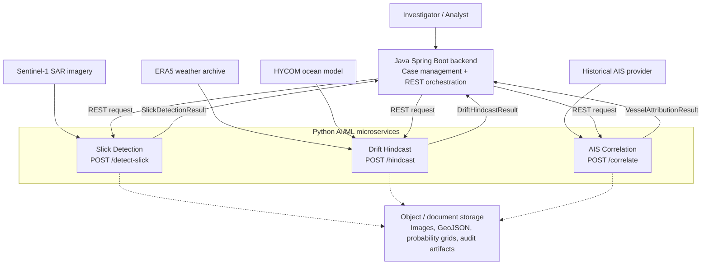

### Responsibilities

| Portion | Responsibility | Does not own |
| --- | --- | --- |
| Java Spring Boot backend | Case lifecycle, authentication, orchestration, UI-facing APIs, persistence of case results | CNN inference, particle physics, AIS scoring logic |
| Slick Detection Service | Convert a SAR image into a georeferenced oil-slick observation | Vessel attribution or spill-source inference |
| Drift Hindcast Service | Estimate possible source regions and spill times from environmental forcing | Vessel identity or legal conclusions |
| AIS Correlation Service | Compare candidate vessels against the probabilistic source and time window | Image segmentation or ocean simulation |
| Storage layer | Preserve source files, intermediate artifacts, model versions, and audit records | Real-time orchestration logic |

## 2. Service and Component Design

```mermaid
flowchart LR
    subgraph DETECTION["Slick Detection FastAPI application"]
        DAPI["DetectionRouter\nPOST /detect-slick"]
        DVALID["RequestValidator"]
        DPIPE["SlickDetectionPipeline"]
        DPRE["SarPreprocessor\nCalibration + Lee filter + land mask"]
        DMODEL["UNetSegmenter\nPyTorch model"]
        DPOST["PolygonExtractor\nrasterio + GDAL + shapely"]
        DREPO["ArtifactRepository"]
        DAPI --> DVALID --> DPIPE
        DPIPE --> DPRE --> DMODEL --> DPOST
        DPIPE --> DREPO
    end

    subgraph HINDCAST["Drift Hindcast FastAPI application"]
        HAPI["HindcastRouter\nPOST /hindcast"]
        HVALID["RequestValidator"]
        HPIPE["DriftHindcastPipeline"]
        LOADERS["EnvironmentalDataLoader\nxarray + netCDF4"]
        ENGINE["OpenOilSimulationEngine\nOpenDrift"]
        PROB["ProbabilityFieldBuilder"]
        HREPO["ArtifactRepository"]
        HAPI --> HVALID --> HPIPE
        HPIPE --> LOADERS
        HPIPE --> ENGINE --> PROB
        HPIPE --> HREPO
    end

    subgraph CORRELATION["AIS Correlation FastAPI application"]
        CAPI["CorrelationRouter\nPOST /correlate"]
        CVALID["RequestValidator"]
        CPIPE["AisCorrelationPipeline"]
        FILTER["SpatioTemporalFilter\ngeopandas + shapely"]
        FEATURES["EvidenceFeatureExtractor\nCPA + timing + anomalies + gaps"]
        SCORER["SuspicionScorer\nConfigurable weighted model"]
        CREPO["ArtifactRepository"]
        CAPI --> CVALID --> CPIPE
        CPIPE --> FILTER --> FEATURES --> SCORER
        CPIPE --> CREPO
    end

    DPOST -->|SlickDetectionResult| HAPI
    PROB -->|DriftHindcastResult| CAPI
```

Each service is independently deployable. The routers contain HTTP concerns only; pipeline classes coordinate domain operations; adapters isolate third-party libraries such as PyTorch, OpenDrift, GDAL, and geopandas.

## 3. Runtime Sequence

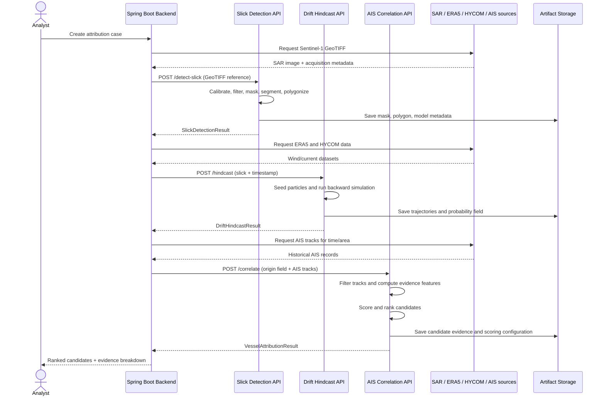

## 4. Low-Level Design: Slick Detection

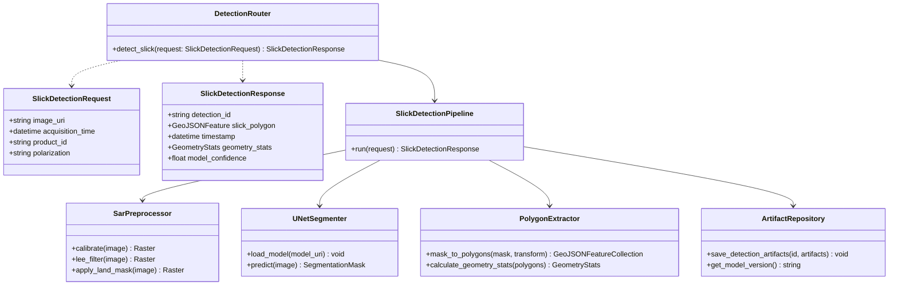

### Detection processing details

1. **Calibration:** Convert raw SAR digital numbers to a physically meaningful backscatter representation such as sigma-nought.
2. **Lee filtering:** Reduce multiplicative speckle while retaining slick boundaries and coastline edges.
3. **Land masking:** Use the raster geotransform and a coastline mask to prevent land artifacts from entering model inference.
4. **Segmentation:** Run the preprocessed raster through a versioned U-Net model. The response should retain model version and confidence metadata.
5. **Polygonization:** Convert connected mask regions into valid geometries, simplify only within an explicit tolerance, and preserve the source CRS in metadata.
6. **Validation:** Reject empty, invalid, or out-of-bounds geometries before returning the result.

## 5. Low-Level Design: Drift Hindcast

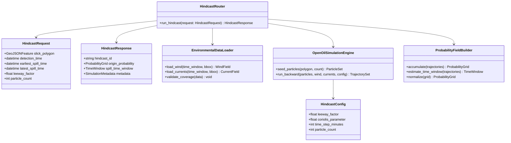

### Hindcast processing details

- The slick polygon defines the final observed particle region.
- The simulation runs backward from the observation time across a configured historical interval.
- ERA5 supplies wind forcing; HYCOM supplies ocean-current forcing.
- Leeway represents wind-induced surface drift that is not captured by current velocity alone.
- Coriolis deflection changes particle heading according to latitude and motion direction.
- The probability grid is produced from particle density, normalized so that cell values are comparable.
- Missing environmental coverage, invalid time ranges, and unrealistic particle counts must be reported as validation errors rather than silently simulated.

## 6. Low-Level Design: AIS Correlation

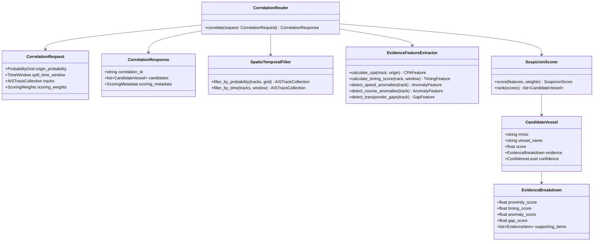

### Correlation scoring details

The score should be explainable and configurable. A conceptual weighted score is:

$$
S_v = w_p P_v + w_t T_v + w_a A_v + w_g G_v
$$

where:

- $P_v$ is proximity to high-probability origin cells.
- $T_v$ is alignment with the estimated spill-time window.
- $A_v$ is speed/course anomaly evidence.
- $G_v$ is evidence from AIS reporting gaps.
- $w_p, w_t, w_a, w_g$ are versioned configuration weights.

The service must return each component of $S_v$, the weights used, the source AIS records, and the scoring-model version. A high score is an investigative lead, not proof of responsibility.

## 7. REST Data Contracts

### `POST /detect-slick`

Request:

```json
{
  "image_uri": "s3://sar-bucket/S1A_2026_001.tif",
  "acquisition_time": "2026-09-24T05:42:00Z",
  "product_id": "S1A_PRODUCT_001",
  "polarization": "VV"
}
```

Response:

```json
{
  "detection_id": "det-001",
  "slick_polygon": { "type": "Feature", "geometry": {}, "properties": {} },
  "timestamp": "2026-09-24T05:42:00Z",
  "geometry_stats": { "area_sq_km": 12.4, "perimeter_km": 18.7 },
  "model_version": "unet-v3",
  "model_confidence": 0.91
}
```

### `POST /hindcast`

Request:

```json
{
  "slick_polygon": { "type": "Feature", "geometry": {}, "properties": {} },
  "detection_time": "2026-09-24T05:42:00Z",
  "earliest_spill_time": "2026-09-20T00:00:00Z",
  "latest_spill_time": "2026-09-24T05:42:00Z",
  "leeway_factor": 0.03,
  "particle_count": 10000
}
```

Response:

```json
{
  "hindcast_id": "hind-001",
  "origin_probability": {
    "grid_uri": "s3://artifacts/hind-001/origin-grid.nc",
    "crs": "EPSG:4326",
    "resolution_km": 1.0
  },
  "spill_time_window": {
    "start": "2026-09-21T06:00:00Z",
    "end": "2026-09-23T18:00:00Z"
  },
  "metadata": { "particle_count": 10000, "engine_version": "opendrift-x" }
}
```

### `POST /correlate`

Request:

```json
{
  "origin_probability_uri": "s3://artifacts/hind-001/origin-grid.nc",
  "spill_time_window": {
    "start": "2026-09-21T06:00:00Z",
    "end": "2026-09-23T18:00:00Z"
  },
  "ais_track_uri": "s3://ais/region-2026-09.parquet",
  "scoring_weights": { "proximity": 0.35, "timing": 0.30, "anomaly": 0.20, "gap": 0.15 }
}
```

Response:

```json
{
  "correlation_id": "corr-001",
  "candidates": [
    {
      "mmsi": "123456789",
      "vessel_name": "EXAMPLE VESSEL",
      "score": 0.82,
      "confidence": "medium",
      "evidence": {
        "proximity_score": 0.91,
        "timing_score": 0.84,
        "anomaly_score": 0.62,
        "gap_score": 0.77
      }
    }
  ],
  "scoring_metadata": { "model_version": "weighted-v1", "generated_at": "2026-09-24T06:00:00Z" }
}
```

## 8. Deployment and Operational Design

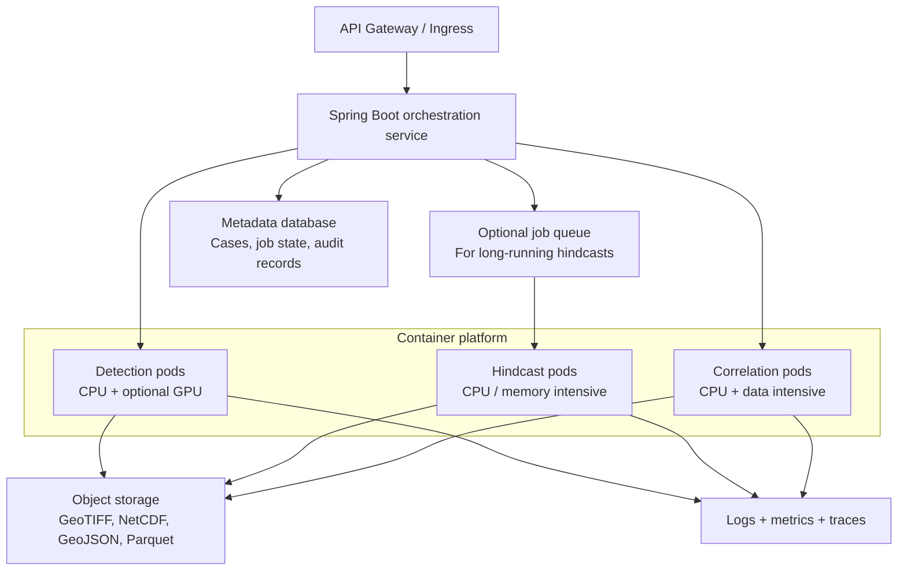

Recommended operational controls:

- Use container images with pinned Python and native-library versions.
- Version U-Net weights, preprocessing configuration, OpenDrift configuration, and scoring weights.
- Store correlation IDs across all requests for end-to-end traceability.
- Apply request limits to GeoTIFF size, particle count, simulation duration, and AIS track range.
- Use asynchronous jobs for hindcasts that exceed normal HTTP request duration.
- Add health endpoints for liveness and readiness, plus metrics for inference time, simulation time, particle count, and failure rate.
- Keep intermediate artifacts so an analyst can reproduce a result later.
- Treat missing, stale, or low-quality source data as explicit evidence-quality warnings.

## 9. Error and Validation Boundaries

| Boundary | Required validation | Example failure |
| --- | --- | --- |
| SAR ingestion | File type, CRS, bands, timestamp, valid raster dimensions | Corrupt GeoTIFF or missing georeference |
| Segmentation | Model availability, tensor dimensions, finite output values | Inference model unavailable |
| Polygon output | Valid geometry, water intersection, non-empty area | Empty or self-intersecting polygon |
| Hindcast input | Valid time range, coordinate bounds, environmental coverage | HYCOM data does not cover requested period |
| Simulation | Particle count, step size, memory budget | Request exceeds resource limit |
| AIS correlation | MMSI validity, timestamp ordering, track quality | Duplicate or unsorted AIS records |
| Attribution output | Evidence completeness, score normalization, model version | Candidate has no supporting evidence |

All errors should return a stable structure containing an error code, human-readable message, correlation ID, and retryability flag. The system should fail closed on invalid geometry or missing evidence rather than manufacture a confident attribution.

## 10. Java Spring Boot Backend Architecture

The Java backend is the system-facing application layer. It owns user workflows, case state, authentication, orchestration, result persistence, and analyst-facing APIs. It delegates scientific computation to the Python services and never duplicates their model logic.

### 10.1 Backend Context Diagram

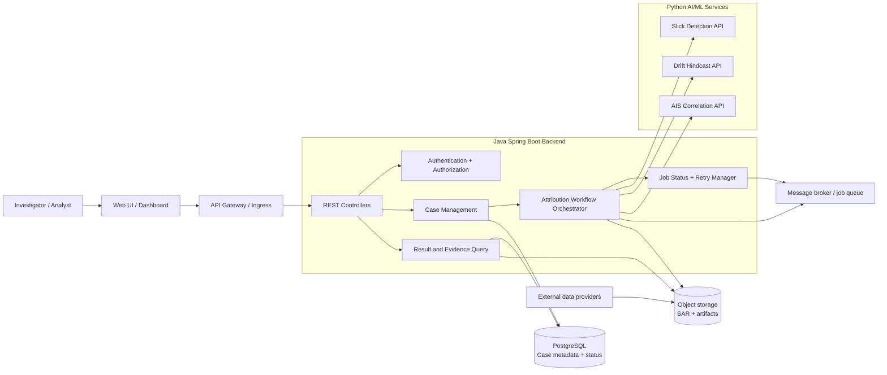

### 10.2 Backend Modules

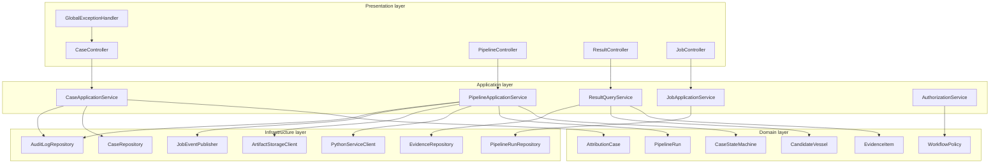

### Module responsibilities

| Module | Responsibility |
| --- | --- |
| `CaseController` | Create, update, list, and retrieve attribution cases. |
| `PipelineController` | Start or resume the three-stage attribution workflow. |
| `ResultController` | Return slick geometry, origin probability, ranked vessels, and evidence. |
| `JobController` | Expose status, progress, retry, and cancellation operations. |
| `CaseApplicationService` | Apply case rules and coordinate case persistence. |
| `PipelineApplicationService` | Enforce stage order and coordinate Python service calls. |
| `CaseStateMachine` | Prevent invalid transitions such as correlation before hindcast completion. |
| `PythonServiceClient` | Typed REST client with timeouts, retries, idempotency, and correlation IDs. |
| `ArtifactStorageClient` | Store and retrieve large GeoTIFF, NetCDF, GeoJSON, and AIS artifacts. |
| `AuditLogRepository` | Preserve who initiated a run, which versions were used, and what changed. |

## 11. Backend Domain Model

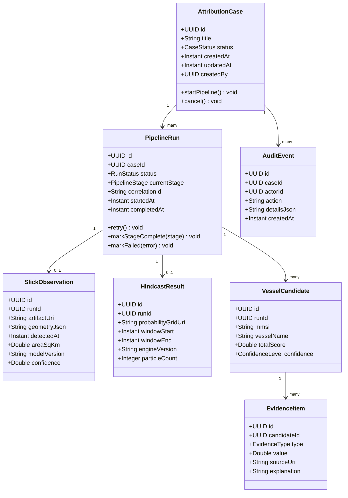

### Case state machine

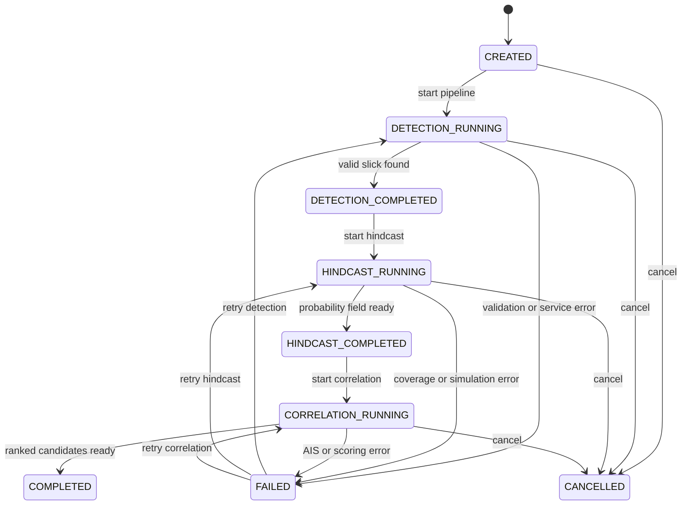

The state machine is persisted, so a service restart does not lose the current workflow stage. Retries resume from the failed stage when its input artifact is still valid.

## 12. Backend REST API Design

### Case endpoints

| Method | Endpoint | Purpose |
| --- | --- | --- |
| `POST` | `/api/v1/cases` | Create an attribution case. |
| `GET` | `/api/v1/cases/{caseId}` | Retrieve case status and summary. |
| `GET` | `/api/v1/cases/{caseId}/timeline` | Retrieve stage and audit history. |
| `POST` | `/api/v1/cases/{caseId}/runs` | Start a new pipeline run. |
| `POST` | `/api/v1/cases/{caseId}/cancel` | Cancel an active run. |
| `GET` | `/api/v1/cases/{caseId}/results` | Retrieve all available results. |

### Example create-case request

```json
{
  "title": "Potential slick near sector A",
  "sarImageUri": "s3://sar-bucket/S1A_2026_001.tif",
  "acquisitionTime": "2026-09-24T05:42:00Z",
  "region": { "minLat": 18.1, "minLon": 72.4, "maxLat": 18.8, "maxLon": 73.2 }
}
```

### Example case response

```json
{
  "caseId": "case-001",
  "runId": "run-001",
  "status": "HINDCAST_RUNNING",
  "currentStage": "DRIFT_HINDCAST",
  "progress": 66,
  "correlationId": "corr-7b3f",
  "links": {
    "self": "/api/v1/cases/case-001",
    "timeline": "/api/v1/cases/case-001/timeline",
    "results": "/api/v1/cases/case-001/results"
  }
}
```

### Backend-to-Python call pattern

1. The backend creates a `PipelineRun` and generates a correlation ID.
2. It sends only references to large files where possible, rather than embedding GeoTIFF or NetCDF content in JSON.
3. Each request includes `X-Correlation-Id`, `X-Idempotency-Key`, and the pipeline-run identifier.
4. A successful response is persisted before the next stage begins.
5. A failed call is classified as retryable or non-retryable and recorded in the audit log.

### Backend-to-FastAPI adapter architecture

The Spring Boot backend communicates with each Python service through a dedicated typed adapter. The backend does not call FastAPI endpoints directly from controllers or workflow code. This keeps transport concerns, authentication, retries, and DTO conversion in one place.

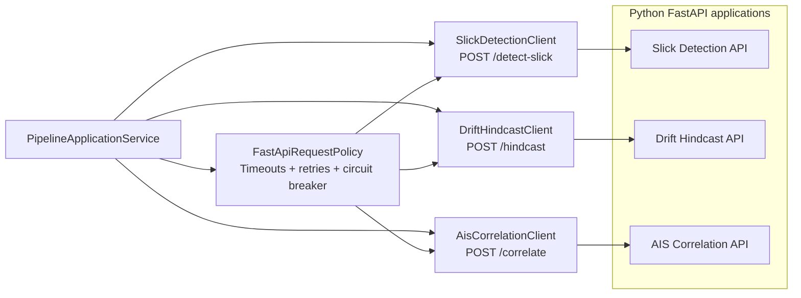

### FastAPI service configuration

Each FastAPI application is independently configured through environment variables or service discovery:

```text
SLICK_DETECTION_BASE_URL=http://slick-detection:8001
DRIFT_HINDCAST_BASE_URL=http://drift-hindcast:8002
AIS_CORRELATION_BASE_URL=http://ais-correlation:8003
FASTAPI_CONNECT_TIMEOUT_MS=2000
FASTAPI_READ_TIMEOUT_MS=30000
FASTAPI_MAX_RETRIES=3
```

The hindcast and correlation services may use longer read timeouts or asynchronous job endpoints than slick detection. These values belong in backend configuration, not in frontend code or request payloads.

### Java client contracts

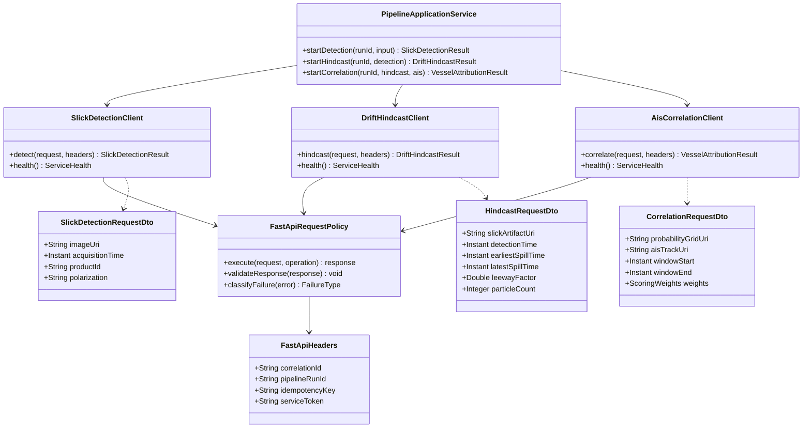

### Java-to-FastAPI request mapping

| Backend adapter | FastAPI endpoint | Request reference | Response persisted by backend |
| --- | --- | --- | --- |
| `SlickDetectionClient` | `POST /detect-slick` | SAR GeoTIFF URI, acquisition time, product ID, polarization | `SlickObservation` and detection artifact metadata |
| `DriftHindcastClient` | `POST /hindcast` | Slick artifact, time bounds, leeway factor, particle count | `HindcastResult` and probability-grid URI |
| `AisCorrelationClient` | `POST /correlate` | Probability-grid URI, spill window, AIS track URI, scoring weights | `VesselCandidate` and `EvidenceItem` records |

### Common FastAPI headers

Every backend request to a Python service should include:

```http
X-Correlation-Id: corr-7b3f
X-Pipeline-Run-Id: run-001
X-Idempotency-Key: run-001-detection
Authorization: Bearer <service-token>
Content-Type: application/json
```

The Python service should echo `X-Correlation-Id` in its response. The backend validates that the response belongs to the active run before persisting it.

### Updated Java-to-FastAPI runtime sequence

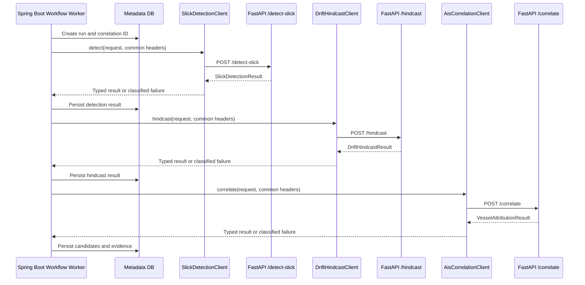

### FastAPI error mapping

| FastAPI response | Backend behavior |
| --- | --- |
| `2xx` with valid payload | Persist result and advance the state machine. |
| `400` or `422` validation error | Mark stage failed as non-retryable and expose field errors. |
| `401` or `403` | Alert service-credential configuration and do not retry blindly. |
| `404` missing artifact | Mark input artifact invalid and require a new input or run. |
| `408`, `429`, or `5xx` | Retry with bounded exponential backoff when policy allows. |
| Timeout or connection failure | Record service-unavailable error and retry through the queue. |
| Invalid or incomplete `2xx` payload | Reject response, preserve raw response metadata, and fail closed. |

The backend should expose a stable error response to the frontend even when the underlying FastAPI error differs:

```json
{
  "code": "FASTAPI_HINDCAST_TIMEOUT",
  "message": "The drift hindcast service did not respond within the configured time limit.",
  "stage": "DRIFT_HINDCAST",
  "retryable": true,
  "correlationId": "corr-7b3f"
}
```

## 13. Orchestration and Asynchronous Jobs

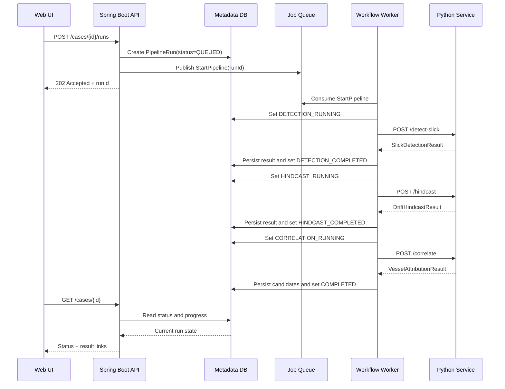

Use synchronous REST for short detection requests and asynchronous job execution for long-running hindcasts or large AIS correlation jobs. The client receives `202 Accepted` and polls the case resource or subscribes to a backend notification channel.

## 14. Persistence Design

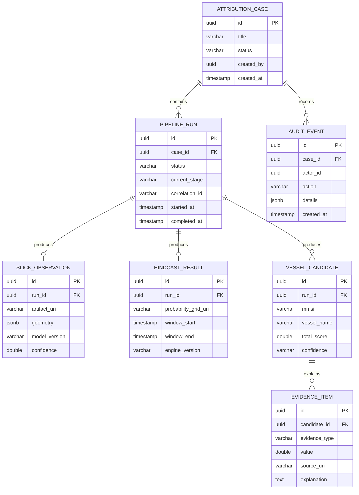

Large scientific artifacts belong in object storage; PostgreSQL stores searchable metadata, relationships, lifecycle state, and small summaries. Use indexes on `PIPELINE_RUN.case_id`, `PIPELINE_RUN.status`, `VESSEL_CANDIDATE.run_id`, and `AUDIT_EVENT.case_id`.

## 15. Backend Security and Reliability

### Security

- Authenticate analysts through OAuth2/OIDC and issue short-lived access tokens.
- Authorize access by case ownership, organization, or investigator role.
- Keep Python service credentials in a secret manager; never expose them to the browser.
- Use mTLS or private network communication between the backend and Python services.
- Generate signed, time-limited artifact URLs instead of making object storage public.
- Validate all external URIs against an allowlist to prevent server-side request forgery.
- Record access to candidate evidence and exported results in the audit log.

### Reliability

- Use connection and read timeouts for every Python-service call.
- Retry only transient failures with exponential backoff and bounded attempts.
- Use idempotency keys so a retried request cannot create duplicate pipeline runs.
- Apply a circuit breaker when a Python service is unavailable.
- Persist the response before advancing the state machine.
- Keep dead-letter queue records for jobs that exceed retry limits.
- Return partial results explicitly, for example `DETECTION_COMPLETED`, rather than presenting an incomplete case as fully attributed.

### Observability

Every backend request and downstream Python call should carry:

- `correlationId`
- `caseId`
- `pipelineRunId`
- `currentStage`
- `modelVersion` or `engineVersion` when applicable

Measure API latency, queue delay, stage duration, retry count, failure count, artifact size, and the age of source data. Logs should contain identifiers and outcome metadata but should not contain access tokens or sensitive raw datasets.

## 16. Frontend Architecture

The frontend is an analyst workstation for creating attribution cases, monitoring the three-stage pipeline, inspecting geospatial outputs, and reviewing ranked vessel evidence. It should make uncertainty visible and should never present a candidate score as a definitive accusation.

### 16.1 Frontend Context Diagram

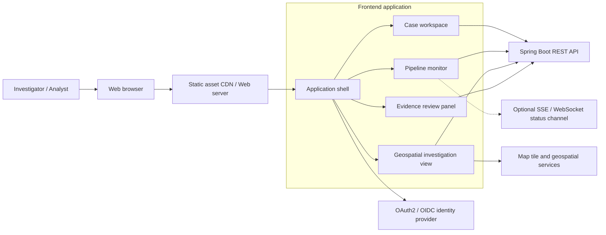

### Frontend responsibilities

| Area | Responsibility |
| --- | --- |
| Application shell | Navigation, authenticated user context, global notifications, responsive layout. |
| Case workspace | Create cases, select source imagery, define region and time settings. |
| Pipeline monitor | Show stage state, progress, duration, errors, retries, and artifact links. |
| Geospatial view | Display SAR extent, slick polygon, origin probability field, vessel tracks, and candidate locations. |
| Evidence review | Compare candidates, expose score factors, show source timestamps, and record analyst notes. |
| API client | Typed requests, request cancellation, polling or live status updates, and normalized errors. |

## 17. Frontend Component Architecture

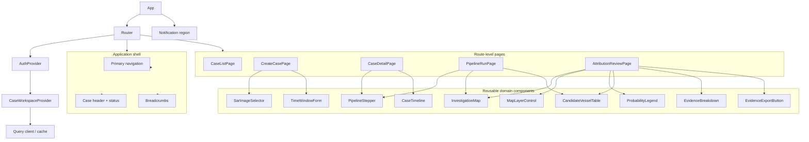

Recommended frontend module structure:

```text
src/
  app/                 Application bootstrap, router, providers
  auth/                OIDC client, route guards, user context
  api/                 Typed REST client, DTOs, error normalization
  cases/               Case pages, forms, case hooks
  pipeline/            Stage status, progress, retry, timeline
  map/                 Map canvas, layers, legends, geospatial adapters
  attribution/         Candidate table, evidence breakdown, notes
  components/          Shared buttons, dialogs, tables, status badges
  state/               Query cache and small UI state stores
  styles/              Tokens, layout, responsive rules
```

The UI components should not call `fetch` directly. Page-level hooks use the API client, and presentational components receive typed data and callbacks as props.

## 18. Frontend Routes and User Workflow

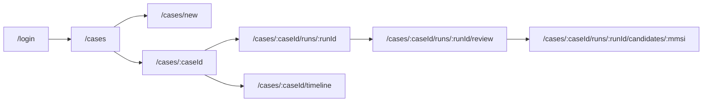

### Main screens

**Case list**

- Search and filter by status, region, date, and owner.
- Show case ID, latest run, current stage, last update, and evidence availability.
- Provide a clear distinction between `RUNNING`, `COMPLETED`, `FAILED`, and `CANCELLED`.

**Create case**

- Select or upload a Sentinel-1 GeoTIFF reference.
- Display acquisition timestamp and geographic bounds before submission.
- Configure hindcast time bounds, particle count, and leeway factor within server-defined limits.
- Validate required fields before enabling pipeline start.

**Case detail / pipeline monitor**

- Show the three stages as a persistent stepper.
- Display stage-specific progress and timestamps.
- Provide retry only for a failed stage with valid stored inputs.
- Link to intermediate artifacts without exposing private storage credentials.

**Attribution review**

- Show the slick polygon and origin probability field on the map.
- Overlay AIS vessel tracks and candidate locations.
- Show ranked candidates in a sortable table.
- Open an evidence panel for each candidate with score components, timestamps, and data-quality warnings.
- Keep analyst notes and system evidence visually separate.

## 19. Frontend Data and State Flow

```mermaid
flowchart TB
    ACTION["User action"]
    FORM["Form state"]
    COMMAND["Command mutation"]
    CACHE["Server-state cache"]
    STORE["Small UI state store"]
    VIEW["Rendered view"]
    LIVE["Polling / SSE update"]
    ERROR["Normalized error state"]

    ACTION --> FORM
    ACTION --> STORE
    FORM --> COMMAND
    COMMAND --> CACHE
    CACHE --> VIEW
    STORE --> VIEW
    LIVE --> CACHE
    COMMAND --> ERROR
    ERROR --> VIEW
```

Use two distinct state categories:

| State type | Examples | Recommended owner |
| --- | --- | --- |
| Server state | Case details, run status, slick geometry, probability metadata, candidates | Query client cache with invalidation and refetch rules |
| Local UI state | Selected map layer, open panel, table sort, active tab, unsaved note | Component state or a small UI store |

The frontend should invalidate or refetch case data after starting, retrying, cancelling, or completing a run. It should avoid duplicating the entire backend case object in multiple component states.

### Pipeline status update behavior

1. After `POST /runs` returns `202 Accepted`, store the `runId` and show `QUEUED`.
2. Poll the case endpoint at a bounded interval, or subscribe to SSE/WebSocket updates.
3. Stop polling when the run reaches `COMPLETED`, `FAILED`, or `CANCELLED`.
4. Refetch results when a stage completes.
5. Preserve the last known result while showing a non-blocking refresh indicator.

## 20. Geospatial Investigation View

```mermaid
flowchart TB
    MAPCANVAS["Map canvas"]
    BASE["Base map / nautical context"]
    SARLAYER["SAR image footprint / raster preview"]
    SLICKLAYER["Detected slick GeoJSON"]
    PROBLAYER["Origin probability heatmap"]
    TRACKLAYER["AIS vessel tracks"]
    CANDLAYER["Candidate vessel markers"]
    CONTROLS["Layer controls + legend + time filter"]
    DETAILS["Selected feature details"]

    MAPCANVAS --> BASE
    MAPCANVAS --> SARLAYER
    MAPCANVAS --> SLICKLAYER
    MAPCANVAS --> PROBLAYER
    MAPCANVAS --> TRACKLAYER
    MAPCANVAS --> CANDLAYER
    CONTROLS --> MAPCANVAS
    MAPCANVAS --> DETAILS
```

### Map behavior

- Use a consistent coordinate reference system for API data and map rendering.
- Render the slick as a highlighted polygon with an outline distinct from probability shading.
- Render the origin field with a legend that explains whether values are normalized probability, density, or relative likelihood.
- Allow toggling layers independently so the analyst can inspect one evidence source at a time.
- Filter AIS tracks by time window and candidate vessel.
- Highlight selected candidates across the map, table, and evidence panel.
- Show data timestamps and source quality near each layer.
- Avoid implying certainty through color intensity alone; pair probability colors with numeric ranges and text labels.

## 21. Frontend Review Interaction

```mermaid
sequenceDiagram
    actor Analyst
    participant Review as Attribution Review Page
    participant API as Spring Boot API
    participant Map as Map Renderer
    participant Table as Candidate Table
    participant Panel as Evidence Panel

    Analyst->>Review: Open completed run
    Review->>API: GET case results
    API-->>Review: Slick, probability field, candidates
    Review->>Map: Render slick and origin layers
    Review->>Table: Render ranked candidates
    Analyst->>Table: Select candidate vessel
    Table->>Panel: Show evidence breakdown
    Panel->>Map: Highlight vessel track and source region
    Analyst->>Review: Change time or map layer filter
    Review->>Map: Update visible evidence
    Analyst->>Review: Add analyst note
    Review->>API: POST analyst note
    API-->>Review: Persisted note + audit event
```

The candidate table and map must share a selected-candidate identifier. Selecting a row highlights the corresponding track; selecting a vessel marker opens the same evidence panel. This prevents the map and tabular ranking from becoming disconnected views.

## 22. Frontend Security, Accessibility, and Error States

### Security

- Use the identity provider through Authorization Code with PKCE.
- Keep access tokens in an approach protected from JavaScript injection, preferably secure same-site cookies managed by the backend.
- Enforce authorization on the backend; frontend route guards are only a usability feature.
- Do not put signed artifact URLs or sensitive identifiers in analytics events.
- Sanitize analyst notes and avoid rendering raw HTML from API responses.
- Display only the candidate evidence the authenticated user is authorized to view.

### Accessibility

- Provide keyboard navigation for tables, tabs, dialogs, map controls, and layer toggles.
- Provide textual alternatives for map-only information, including a candidate table and probability summary.
- Use status text in addition to color for pipeline states and evidence warnings.
- Preserve visible focus, readable contrast, and responsive layouts for tablet-sized investigation screens.
- Announce asynchronous stage changes to assistive technology without repeatedly interrupting the user.

### Required UI states

| State | Frontend behavior |
| --- | --- |
| Loading | Show the current operation and preserve stable layout dimensions. |
| Empty | Explain which stage has not produced data yet. |
| Partial | Show completed artifacts and identify the next unavailable stage. |
| Retryable error | Show retry action, error code, and correlation ID. |
| Permission denied | Hide restricted data and explain the access boundary. |
| Stale data | Show source timestamp and a visible stale-data warning. |
| No candidates | Report that no vessel met the configured criteria; do not imply innocence or blame. |
| Completed | Show ranked candidates, evidence, model versions, and audit timestamp. |

## 23. Frontend Build and Deployment

```mermaid
flowchart TB
    DEV["Frontend source"] --> BUILD["CI build + typecheck + tests"]
    BUILD --> BUNDLE["Versioned static bundle"]
    BUNDLE --> CDN["CDN / web server"]
    CDN --> BROWSER["Analyst browser"]
    BROWSER --> GATEWAY["API Gateway"]
    GATEWAY --> BACKEND["Spring Boot backend"]
    BROWSER --> IDP["OIDC provider"]
    BROWSER --> MAPS["Approved map tile service"]
```

Recommended frontend quality gates:

- Typecheck all API DTOs and component props.
- Unit-test state transitions, score formatting, evidence aggregation, and error normalization.
- Component-test forms, pipeline status, candidate selection, and permission states.
- Run browser tests for case creation, retry, map/table synchronization, and evidence review.
- Test responsive layouts and keyboard navigation at the target investigation resolutions.
- Pin frontend dependencies and produce a content-hashed, immutable build artifact.
